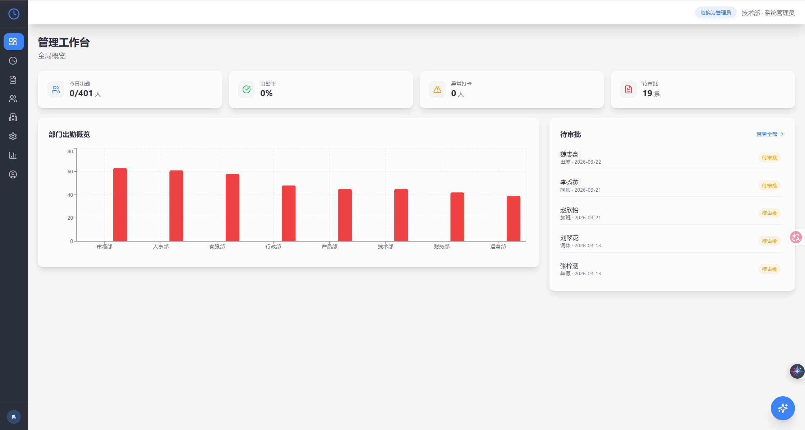
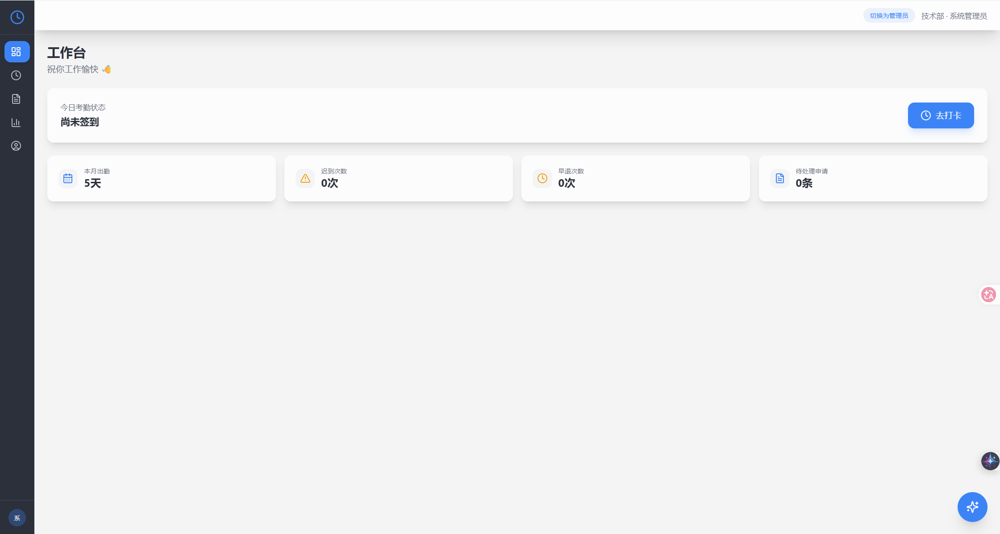
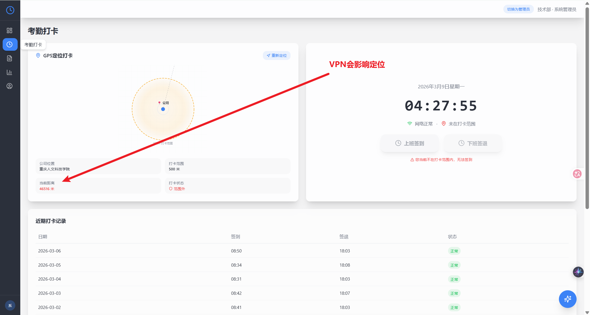
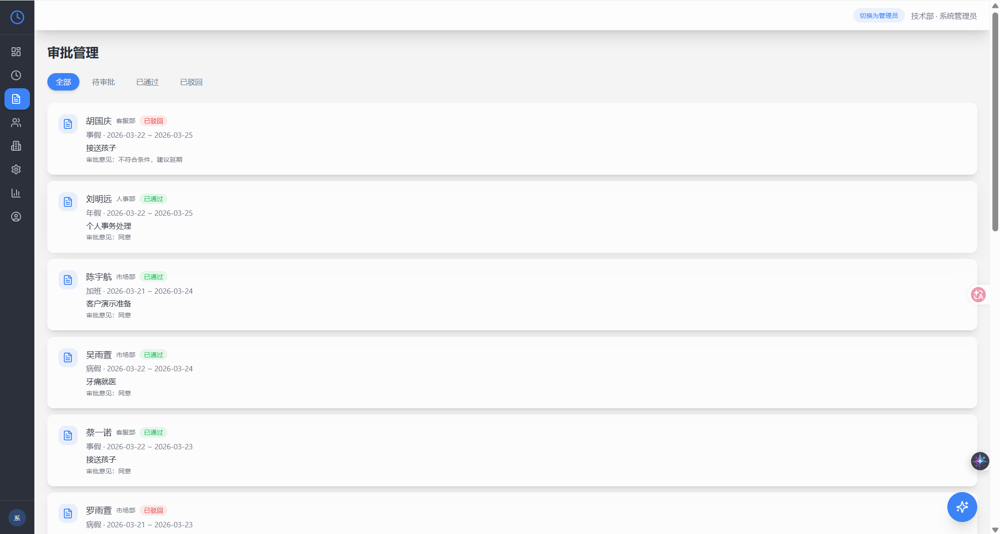
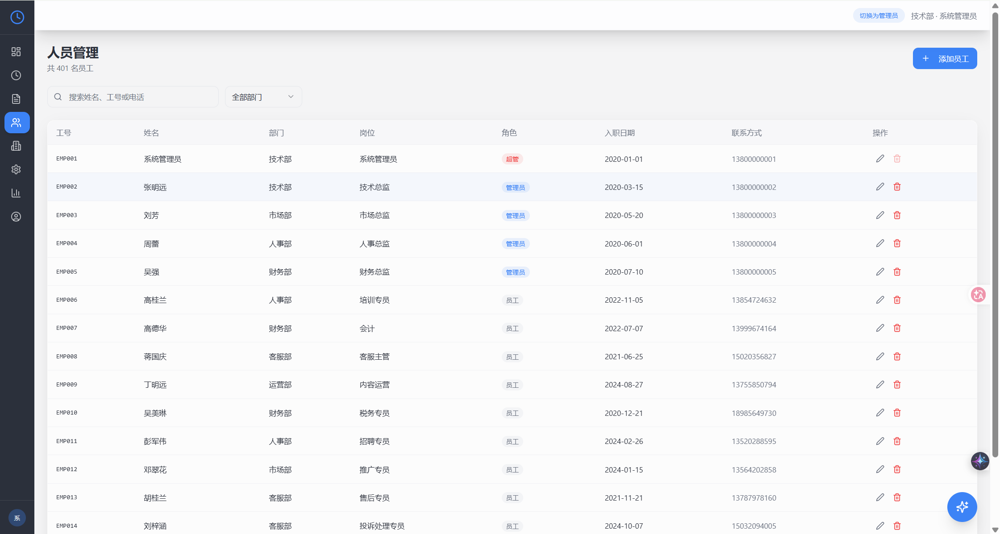
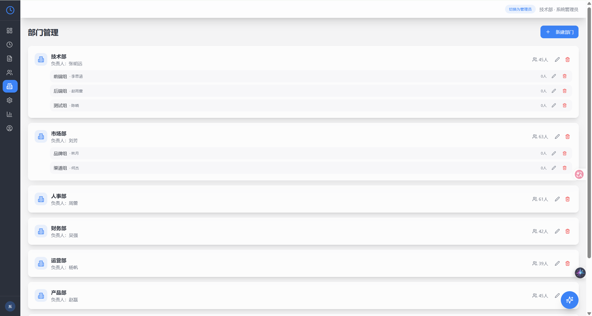
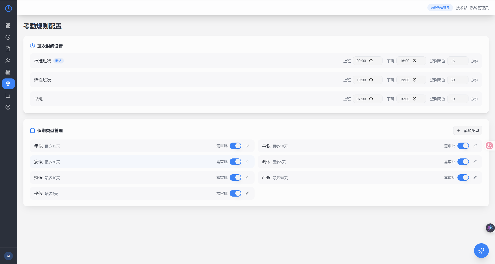
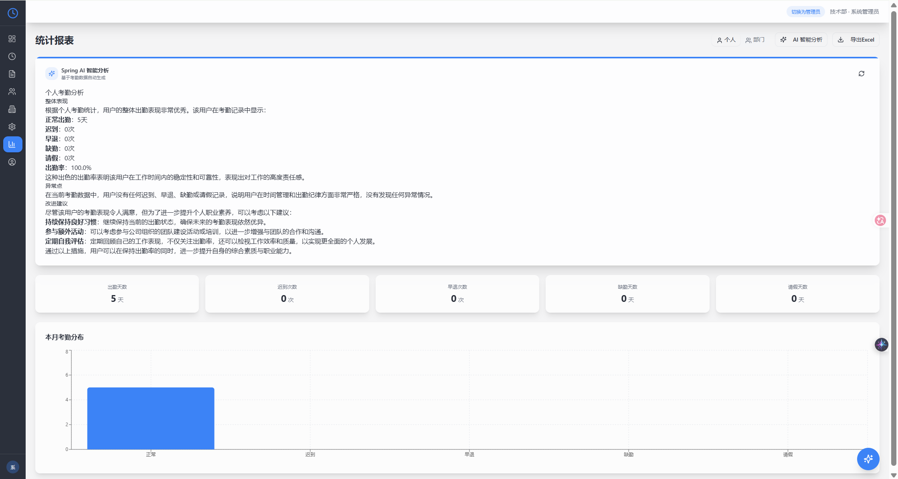
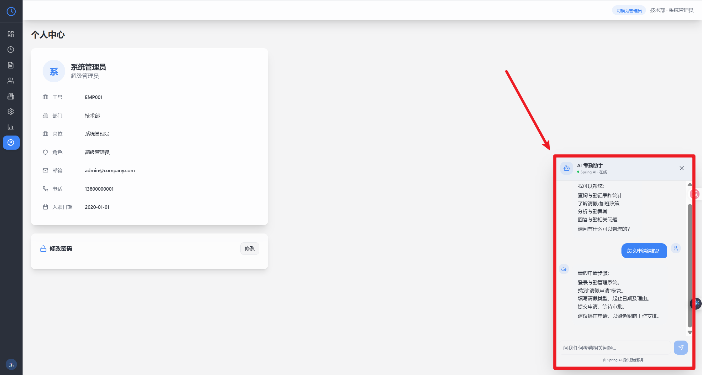

# 毕业设计：基于 React 与 Spring Boot 的考勤管理系统

> Attendance Management System  
> Graduation Project / Full Stack Project

这是一个用于毕业设计展示与完整联调的前后端一体化考勤管理系统，包含员工端与管理员端两类使用场景，支持登录认证、考勤打卡、请假审批、员工与部门管理、考勤规则配置、统计报表导出以及 Spring AI 智能分析能力。


## 项目简介

本系统围绕“企业日常考勤管理”这一实际业务场景设计，目标是实现一个具备完整业务闭环的全栈项目：

- 员工可以登录系统，完成上下班打卡、查看考勤记录、提交请假申请、查看审批状态和个人统计数据
- 管理员可以查看全局工作台、处理待审批申请、维护员工与部门、配置考勤规则、查看统计报表
- 系统接入 Spring AI，用于 AI 聊天问答和报表摘要分析


## 项目结构

```text
FuckGraduationProject/
  README.md                         根目录总说明文档
  .gitignore                        根目录统一忽略规则
  ai-assisted-development-hub/      前端项目（React + Vite）
    README.md                       前端说明文档
    API-DOCUMENTATION.md            接口文档
    database.sql                    数据库初始化脚本
    public/
      favicon.svg                   前端站点图标
      placeholder.svg               前端占位图资源
    src/                            前端源码
  development-hub-backend/          后端项目（Spring Boot）
    README.md                       后端说明文档
    pom.xml                         Maven 配置
    src/main/java/                  后端源码
    src/main/resources/             配置文件与 Mapper XML
```

## 功能模块

### 员工端功能

- 用户登录与获取当前用户信息
- 考勤打卡、签到签退状态查看
- 个人考勤记录查询
- 发起请假 / 调休 / 出差 / 加班申请
- 查看个人审批状态
- 查看个人月度统计报表
- 使用 AI 助手查询个人考勤情况

### 管理端功能

- 管理工作台总览
- 待审批事项查看与审批处理
- 员工新增、编辑、删除、重置密码
- 部门管理
- 考勤规则管理
- 统计报表查看与导出
- AI 智能分析

### 系统能力

- JWT 鉴权
- 基于角色的权限控制
- MyBatis-Plus 数据访问
- MySQL 数据初始化脚本
- Spring AI 集成
- 前后端分离部署

## 技术栈

### 前端

- React 18.3.1
- TypeScript 5.8.3
- Vite 5.4.19
- React Router DOM 6.30.1
- TanStack React Query 5.83.0
- Tailwind CSS 3.4.17
- Framer Motion 11.0.0
- Lucide React 0.462.0
- Recharts 2.15.4
- shadcn/ui（基于 Radix UI 组件体系封装）

### 后端

- Spring Boot 3.5.11
- Spring AI 1.1.2
- MyBatis-Plus 3.5.9
- PageHelper 6.0.0
- JJWT 0.12.6
- Hutool 5.8.34
- Apache POI 5.4.1
- Knife4j 4.5.0
- Spring Security（由 Spring Boot 3.5.11 统一管理）
- MySQL 8.0+

## 开发环境与版本

- JDK 17 或更高版本：`pom.xml` 中配置为 Java 17，本地联调时使用过 Java 21
- Node.js 18 或更高版本：推荐使用 Node.js 20 LTS
- npm 9 或更高版本
- Maven 3.9.x
- MySQL 8.0+

## 开发说明

### 前端来源

- 前端页面原型、基础界面与部分接口文档初稿由 Lovable 生成

### 后端来源

- 后端代码实现、联调修复、功能补全、日志增强与代码审查由 Codex 完成

## 本地运行

### 1. 初始化数据库

数据库脚本位于：

```text
ai-assisted-development-hub/database.sql
```

默认演示数据说明：

- 初始化脚本会导入 1 个超级管理员、4 个管理员和 395 个普通员工示例数据
- 首次启动后端时，如果检测到种子密码占位符，系统会在后端日志中输出初始化密码
- 登录后建议立即在“人员管理”中重置关键账号密码

### 2. 启动后端

进入目录：

```bash
cd development-hub-backend
```

配置环境变量：

```bash
DB_URL=jdbc:mysql://localhost:3306/attendance_system?useUnicode=true&characterEncoding=utf8&serverTimezone=Asia/Shanghai&useSSL=false&allowPublicKeyRetrieval=true
DB_USERNAME=root
DB_PASSWORD=your_password
JWT_SECRET=replace-with-a-secure-secret
OPENAI_BASE_URL=https://api.openai.com
OPENAI_API_KEY=your_api_key
OPENAI_MODEL=gpt-4o-mini
SEED_SUPER_ADMIN_PASSWORD=your_init_admin_password
SEED_COMMON_USER_PASSWORD=your_init_user_password
```

运行：

```bash
mvn spring-boot:run
```

默认后端地址：

```text
http://localhost:8080
```

如果未显式设置 `SEED_SUPER_ADMIN_PASSWORD` 和 `SEED_COMMON_USER_PASSWORD`，系统会在首次初始化示例数据时自动生成密码并打印到后端日志。

### 3. 启动前端

进入目录：

```bash
cd ai-assisted-development-hub
```

安装依赖并运行：

```bash
npm install
npm run dev
```

默认前端地址：

```text
http://localhost:5173
```

如需单独指定接口地址，可创建 `.env.local`：

```bash
VITE_API_BASE_URL=http://localhost:8080/api
VITE_SPRING_AI_API_BASE=http://localhost:8080/api/ai
```

## AI 联调说明

本项目已接入 Spring AI，后端日志会明确输出当前请求是否真正走到了大模型。

如果后端日志出现：

```text
AI chat succeeded via Spring AI ...
AI summary succeeded via Spring AI ...
```

说明 AI 已经真实调用成功。

如果出现：

```text
fallback
disabled
Spring AI chat failed
```

说明当前请求走的是本地兜底逻辑，而不是模型真实返回。

## 文档列表

- 前端项目说明：[ai-assisted-development-hub/README.md](./ai-assisted-development-hub/README.md)
- 接口文档：[ai-assisted-development-hub/API-DOCUMENTATION.md](./ai-assisted-development-hub/API-DOCUMENTATION.md)
- 后端项目说明：[development-hub-backend/README.md](./development-hub-backend/README.md)

## 项目亮点

- 基于前后端分离架构实现完整考勤业务闭环，包含认证、打卡、审批、管理和统计分析
- 同时覆盖员工端与管理员端场景，具备较完整的业务角色划分
- 支持 JWT 鉴权与基于角色的权限控制
- 支持管理员重置员工密码、待审批跳转、工作台卡片联动等实际业务细节
- 集成 Spring AI，用于 AI 对话与统计摘要分析，并在后端日志中可区分真实模型调用与 fallback
- 提供数据库初始化脚本，便于本地演示、联调与部署复现

### 系统截图展示位

以下截图已经接入 README，可直接用于仓库首页展示与答辩说明：

#### 登录页面


#### 管理工作台



#### 员工工作台



#### 考勤打卡



#### 审批管理



#### 人员管理



#### 部门管理



#### 考勤规则



#### 统计报表



#### AI 助手



### 核心业务流程说明

系统的核心业务流程围绕“员工发起操作、系统记录数据、管理员处理审批、工作台与报表同步更新”展开，主要链路如下：

1. 员工使用账号密码登录系统，完成身份认证并获取当前角色权限。
2. 员工在考勤打卡页面完成签到与签退，系统结合定位、时间和规则判断打卡状态。
3. 员工可在审批管理中发起请假、调休、出差或加班申请，申请进入待审批队列。
4. 管理员在工作台或审批管理页面查看待审批事项，并执行通过或驳回操作。
5. 审批结果会同步影响相关业务数据，包括申请状态、工作台统计和统计报表结果。
6. 用户可在工作台、考勤记录和统计报表中查看最终结果，AI 模块则基于这些业务数据给出问答与摘要分析。

### 前后端技术架构说明

本项目采用前后端分离架构，整体分为展示层、接口层、业务层、数据层和 AI 集成层：

- 展示层：前端基于 React、TypeScript、Vite、shadcn/ui、Tailwind CSS 实现，负责页面展示、交互逻辑和角色界面切换。
- 接口层：前端通过统一的 API 服务模块与后端通信，请求采用 RESTful 风格，并通过 JWT 进行登录态校验。
- 业务层：后端基于 Spring Boot、Spring Security、MyBatis-Plus 和 PageHelper 实现认证、员工管理、部门管理、打卡、审批和统计分析等业务逻辑。
- 数据层：系统使用 MySQL 存储员工、部门、考勤记录、请假申请、规则配置与公司参数等核心数据。
- AI 集成层：后端通过 Spring AI 调用 OpenAI-compatible 模型服务，为 AI 聊天和报表摘要提供能力支持，并在日志中区分真实模型调用与 fallback。

### 部署架构说明

项目适合采用单体后端 + 静态前端的前后端分离部署方式，推荐部署结构如下：

- 浏览器访问前端页面，前端可由 Nginx 提供静态资源访问服务。
- 所有 `/api` 请求通过反向代理转发到 Spring Boot 后端服务。
- 后端运行在独立端口上，负责处理业务逻辑、权限认证和数据访问。
- MySQL 作为持久化存储层，可部署在同一台服务器，也可使用独立数据库实例。
- 如果启用 AI 功能，后端通过 Spring AI 连接外部大模型接口，实现智能问答与摘要分析。
